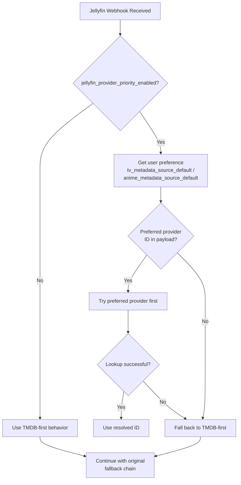
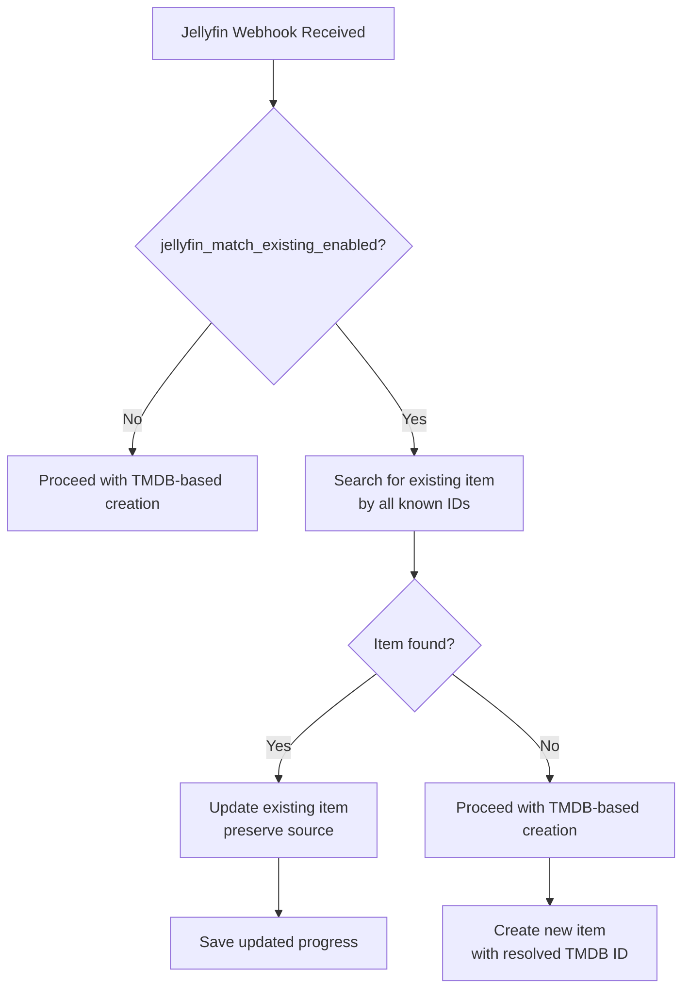

# Jellyfin Integration Features - Implementation Plan

## Overview

This document outlines the implementation plan for two new Jellyfin integration features:

1. **Provider Priority by Media Type**: When enabled, use the user's configured metadata provider preferences (`tv_metadata_source_default`, `anime_metadata_source_default`) as the primary source for identity resolution, falling back to TMDB-first behavior if unavailable.

2. **Existing Item Matching**: When enabled, attempt to find already-tracked items matching the incoming webhook data (by any known provider ID) instead of always creating new items based on TMDB IDs.

This implementation plan might not be perfect and could contain some errors. Additions should be verified.

---

## Feature #1: Provider Priority by Media Type

### User-Visible Behavior

When this setting is **OFF** (default):
- Current behavior preserved: Always prioritize TMDB first, then TVDB/IMDB lookups, then title search fallback

When this setting is **ON**:
- For TV shows: Use `user.tv_metadata_source_default` preference first
- For anime: Use `user.anime_metadata_source_default` preference first  
- If preferred provider has no valid ID or lookup fails -> fall back to TMDB-first behavior

### Data Model Changes

Add a new field to `src/users/models.py` (User model):

```python
jellyfin_provider_priority_enabled = models.BooleanField(
    default=False,
    help_text="Prioritize your Metadata Providers preference when resolving Jellyfin webhooks",
)
```

### Technical Implementation

#### File: `src/integrations/webhooks/jellyfin.py`

**New method**: `_get_jellyfin_provider_priority(self, user, media_type)`

```python
def _get_jellyfin_provider_priority(self, user, media_type):
    """Return ordered list of providers to try for webhook resolution.
    
    Returns list like ['tmdb', 'tvdb', 'imdb'] or ['mal', 'tmdb', 'tvdb']
    based on user preferences when jellyfin_provider_priority_enabled is True.
    Falls back to ['tmdb', 'tvdb', 'imdb'] when disabled.
    """
    if not getattr(user, 'jellyfin_provider_priority_enabled', False):
        return [Sources.TMDB.value, Sources.TVDB.value, Sources.IMDB.value]
    
    # Get user's preferred source for this media type
    if media_type == MediaTypes.TV.value:
        preferred = getattr(user, 'tv_metadata_source_default', Sources.TMDB.value)
    elif media_type == MediaTypes.ANIME.value:
        preferred = getattr(user, 'anime_metadata_source_default', Sources.MAL.value)
    else:  # Movie
        preferred = Sources.TMDB.value
    
    # Build priority list: preferred first, then others
    all_providers = [Sources.TMDB.value, Sources.TVDB.value, Sources.MAL.value]
    if preferred in all_providers:
        return [preferred] + [p for p in all_providers if p != preferred]
    return [Sources.TMDB.value, Sources.TVDB.value, Sources.TMDB.value]
```

**Modified method**: `_find_tv_media_id(self, ids, user=None)`

```python
def _find_tv_media_id(self, ids, user=None):
    """Find TV media ID respecting user's provider priority preference.
    
    When jellyfin_provider_priority_enabled is True, tries providers
    in user-preferred order before falling back to TMDB-first behavior.
    """
    # Determine provider priority order
    media_type = MediaTypes.TV.value
    provider_order = self._get_jellyfin_provider_priority(user, media_type) if user else [Sources.TMDB.value]
    
    # Try each provider in priority order
    for provider in provider_order:
        ext_id = ids.get(f"{provider}_id")
        if not ext_id:
            continue
        
        try:
            if provider == Sources.TMDB.value:
                # Direct TMDB ID usage
                media_id = int(ext_id)
                return media_id, None, None
            
            elif provider == Sources.TVDB.value:
                response = app.providers.tmdb.find(ext_id, "tvdb_id")
                if response.get("tv_episode_results"):
                    result = response["tv_episode_results"][0]
                    return result.get("show_id"), result.get("season_number"), result.get("episode_number")
                if response.get("tv_results"):
                    return result.get("id"), None, None
            
            elif provider == Sources.IMDB.value:
                response = app.providers.tmdb.find(ext_id, "imdb_id")
                if response.get("tv_episode_results"):
                    result = response["tv_episode_results"][0]
                    return result.get("show_id"), result.get("season_number"), result.get("episode_number")
                if response.get("tv_results"):
                    return result.get("id"), None, None
        except Exception as exc:
            logger.debug("Failed lookup via %s: %s", provider, exc)
            continue
    
    # No provider succeeded - fall back to original behavior
    logger.info("Provider priority lookup failed, falling back to original behavior")
    return super()._find_tv_media_id(ids)
```

**Modified method**: `_process_movie(self, payload, user, ids)`

Similar logic - check if movie's preferred provider (TMDB) is available in `ids`, otherwise fall back to IMDB lookup.

---

## Feature #2: Existing Item Matching

### User-Visible Behavior

When this setting is **OFF** (default):
- Current behavior preserved: Always create/update items based on resolved TMDB ID (or follow feature #1 if enabled)

When this setting is **ON**:
- Before creating new item, search for existing TRACKED (in progress, planning...) items by ANY known provider ID
- If found, update progress/history on existing item instead
- Preserves original identity provider (`Item.source`)
- If not found, revert to the normal behavior (feature #1 if enabled, else TMDB..)

### Data model changes

Add a new field to `src/users/models.py` (User model):

```python
jellyfin_match_existing_enabled = models.BooleanField(
    default=False,
    help_text="Try matching existing tracked items by any metadata provider first",
)
```

### Technical Implementation

#### File: `src/integrations/webhooks/jellyfin.py`

**New method**: `_find_existing_item(self, user, media_type, ids, season_number=None, episode_number=None)`

```python
def _find_existing_item(self, user, media_type, ids, season_number=None, episode_number=None):
    """Find existing tracked item by any known provider ID.
    
    Searches for items matching tmdb_id, tvdb_id, imdb_id, mal_id, etc.
    Returns (item, created) tuple where created=False if match found.
    """
    if not getattr(user, 'jellyfin_match_existing_enabled', False):
        return None, True
    
    # Build query for all known external IDs
    id_lookups = Q()
    
    if ids.get('tmdb_id'):
        id_lookups |= Q(media_type=media_type, source=Sources.TMDB.value, media_id=ids['tmdb_id'])
    
    if ids.get('tvdb_id'):
        id_lookups |= Q(media_type=media_type, source=Sources.TVDB.value, 
                       provider_external_ids__contains={'tvdb_id': str(ids['tvdb_id'])})
    
    if ids.get('imdb_id'):
        id_lookups |= Q(media_type=media_type, source=Sources.TMDB.value,
                       provider_external_ids__contains={'imdb_id': str(ids['imdb_id'])})
    
    if ids.get('mal_id') and media_type == MediaTypes.ANIME.value:
        id_lookups |= Q(media_type=media_type, source=Sources.MAL.value, media_id=ids['mal_id'])
    
    # Also check ItemProviderLink table for cross-provider mappings
    if media_type == MediaTypes.TV.value or media_type == MediaTypes.ANIME.value:
        provider_links = ItemProviderLink.objects.filter(
            provider__in=['tmdb', 'tvdb', 'mal', 'igdb'],
            provider_media_type=media_type,
        )
        
        if ids.get('tmdb_id'):
            provider_links = provider_links.filter(
                Q(provider='tmdb', provider_media_id=ids['tmdb_id']) |
                Q(item__source='tmdb', item__provider_external_ids__contains={'tmdb_id': ids['tmdb_id']})
            )
        
        if ids.get('tvdb_id'):
            provider_links = provider_links.filter(
                Q(provider='tvdb', provider_media_id=ids['tvdb_id']) |
                Q(item__source='tvdb', item__provider_external_ids__contains={'tvdb_id': ids['tvdb_id']})
            )
        
        for link in provider_links[:10]:  # Limit results
            try:
                item = link.item
                if item.user == user and item.media_type == media_type:
                    return item, False
            except:
                continue
    
    # Episode-level matching for TV/anime
    if season_number is not None and episode_number is not None:
        episode_lookups = Q(
            media_type=MediaTypes.EPISODE.value,
            parent_item__user=user,
            parent_item__media_type=media_type,
        )
        
        # Match by any known ID at episode level
        if ids.get('tmdb_id'):
            episode_lookups |= Q(media_id=ids['tmdb_id'])
        
        if ids.get('tvdb_id'):
            episode_lookups |= Q(provider_external_ids__contains={'tvdb_id': str(ids['tvdb_id'])})
        
        episode_items = Episode.objects.filter(episode_lookups)[:5]
        for ep in episode_items:
            if ep.season_number == season_number and ep.episode_number == episode_number:
                return ep.item, False
    
    return None, True
```

**Modified method**: `_process_tv(self, payload, user, ids, season_number=None, episode_number=None)`

```python
def _process_tv(self, payload, user, ids, season_number=None, episode_number=None):
    """Process TV episode webhook with optional existing item matching."""
    
    # First, check for existing item if feature is enabled
    existing_item, created = self._find_existing_item(
        user, MediaTypes.TV.value, ids, season_number, episode_number
    )
    
    if existing_item and not created:
        logger.info("Found existing item for TV episode, updating instead of creating")
        # Update existing item's progress directly
        self._update_existing_item(existing_item, payload, user)
        return
    
    # Original processing logic continues here...
    # (rest of existing _process_tv implementation)
```

**New method**: `_update_existing_item(self, item, payload, user)`

```python
def _update_existing_item(self, item, payload, user):
    """Update progress on existing item without changing its identity provider."""
    from app.models import Status
    
    # Extract playback data from payload
    movie_played = self._is_played(payload)
    now = self._get_played_at(payload) or timezone.now().replace(second=0, microsecond=0)
    
    # Get or create the appropriate instance based on item type
    if item.media_type == MediaTypes.MOVIE.value:
        instances = app.models.Movie.objects.filter(item=item, user=user)
    elif item.media_type == MediaTypes.TV.value:
        # For TV, we need to find the season/episode instance
        instances = app.models.SeasonEpisode.objects.filter(item=item, user=user)
    else:
        # Fallback
        instances = []
    
    current_instance = instances.first()
    
    if current_instance:
        # Update existing instance
        current_instance.progress = 1 if movie_played else current_instance.progress
        if movie_played:
            current_instance.end_date = now
            current_instance.status = Status.COMPLETED.value
        elif current_instance.status != Status.IN_PROGRESS.value:
            current_instance.start_date = now
            current_instance.status = Status.IN_PROGRESS.value
        current_instance.save()
    else:
        # Create new instance for this item
        if item.media_type == MediaTypes.MOVIE.value:
            instance = app.models.Movie.objects.create(
                item=item,
                user=user,
                progress=1 if movie_played else 0,
                status=Status.COMPLETED.value if movie_played else Status.IN_PROGRESS.value,
                start_date=now,
                end_date=now if movie_played else None,
            )
        # Handle other media types similarly
    
    return current_instance or instance
```

---

## UI Implementation

### File: `src/templates/users/integrations.html`

Add toggle switches after the Jellyfin integration sections:

```html
<!-- After official Jellyfin section -->
<div class="bg-[#39404b] p-5 rounded-lg mb-6">
  <div class="flex items-center mb-3">
    
    <h3 class="text-base font-medium">Jellyfin Settings</h3>
  </div>
  
  <!-- Setting #1: Provider Priority -->
  <div class="mb-4 pb-4 border-b border-gray-700">
    <label class="flex items-center justify-between cursor-pointer">
      <div>
        <span class="text-sm font-medium text-white">Prioritize Metadata Provider Preference</span>
        <p class="text-xs text-gray-400 mt-1">
          Use your Preferences -> Metadata Providers setting (TV/Anime metadata source) when resolving Jellyfin webhooks. Falls back to TMDB if unavailable.
        </p>
      </div>
      <input type="checkbox" name="jellyfin_provider_priority_enabled" 
             class="w-4 h-4 text-indigo-600 bg-gray-700 border-gray-600 rounded focus:ring-indigo-600"
             checked>
    </label>
  </div>
  
  <!-- Setting #2: Match Existing Items -->
  <div>
    <label class="flex items-center justify-between cursor-pointer">
      <div>
        <span class="text-sm font-medium text-white">Match Existing Tracked Items</span>
        <p class="text-xs text-gray-400 mt-1">
          Attempt to find already-tracked shows/movies by any provider ID (TMDB, TVDB, MAL, etc.) instead of always creating new entries.
        </p>
      </div>
      <input type="checkbox" name="jellyfin_match_existing_enabled" 
             class="w-4 h-4 text-indigo-600 bg-gray-700 border-gray-600 rounded focus:ring-indigo-600"
             checked>
    </label>
  </div>
  
  <div class="pt-4 flex justify-end">
    <button type="submit"
            class="flex items-center px-4 py-2 bg-indigo-600 text-white rounded-md hover:bg-indigo-700 transition-colors text-sm cursor-pointer">
      
      Save Settings
    </button>
  </div>
</div>
```

### File: `src/users/views.py`

Modify the `integrations` view to handle POST requests:

```python
@require_http_methods(["GET", "POST"])
def integrations(request):
    """Render the integrations settings page."""
    user = request.user
    
    if request.method == "POST":
        # Handle Jellyfin settings form submission
        jellyfin_provider_priority = request.POST.get('jellyfin_provider_priority_enabled') == 'on'
        jellyfin_match_existing = request.POST.get('jellyfin_match_existing_enabled') == 'on'
        
        user.jellyfin_provider_priority_enabled = jellyfin_provider_priority
        user.jellyfin_match_existing_enabled = jellyfin_match_existing
        user.save(update_fields=[
            'jellyfin_provider_priority_enabled',
            'jellyfin_match_existing_enabled',
        ])
        
        messages.success(request, "Jellyfin settings saved successfully.")
        return redirect('integrations')
    
    # ... rest of existing GET handler
```

---

## Migration

Create migration file: `src/users/migrations/XXXX_add_jellyfin_settings.py`

```python
from django.db import migrations, models


class Migration(migrations.Migration):

    dependencies = [
        ('users', 'XXXX_previous_migration'),
    ]

    operations = [
        migrations.AddField(
            model_name='user',
            name='jellyfin_provider_priority_enabled',
            field=models.BooleanField(
                default=False,
                help_text="Prioritize your Metadata Providers preference when resolving Jellyfin webhooks",
            ),
        ),
        migrations.AddField(
            model_name='user',
            name='jellyfin_match_existing_enabled',
            field=models.BooleanField(
                default=False,
                help_text="Match existing tracked items by any provider ID instead of always using TMDB",
            ),
        ),
    ]
```

---

## Testing Strategy

### Unit Tests: `src/integrations/tests/test_webhooks_jellyfin.py`

```python
class TestJellyfinProviderPriority(TestCase):
    """Tests for provider priority feature."""
    
    def setUp(self):
        self.user = get_user_model().objects.create_superuser(
            username='testuser',
            password='testpass',
            email='test@example.com',
        )
        self.url = reverse("jellyfin_webhook", kwargs={"token": self.user.token})
    
    def test_provider_priority_off_uses_tmdb_first(self):
        """When disabled, should use TMDB-first behavior."""
        self.user.jellyfin_provider_priority_enabled = False
        self.user.save()
        
        payload = {
            "Event": "Stop",
            "Item": {
                "Type": "Episode",
                "Name": "Test Episode",
                "SeriesName": "Test Show",
                "ProviderIds": {"Tvdb": "12345"},  # No TMDB ID
                "UserData": {"Played": True},
                "ParentIndexNumber": 1,
                "IndexNumber": 5,
            }
        }
        
        # Should still work via title search fallback
        response = self.client.post(self.url, payload, content_type="application/json")
        self.assertEqual(response.status_code, 200)
    
    def test_provider_priority_on_uses_user_preference(self):
        """When enabled, should use user's metadata source preference."""
        self.user.jellyfin_provider_priority_enabled = True
        self.user.tv_metadata_source_default = Sources.MAL.value
        self.user.save()
        
        # Test with MAL ID in payload
        payload = {
            "Event": "Stop",
            "Item": {
                "Type": "Episode",
                "Name": "One Piece",
                "SeriesName": "One Piece",
                "ProviderIds": {"Mal": "21"},  # MAL ID
                "UserData": {"Played": True},
                "ParentIndexNumber": 1,
                "IndexNumber": 1,
            }
        }
        
        response = self.client.post(self.url, payload, content_type="application/json")
        self.assertEqual(response.status_code, 200)


class TestJellyfinMatchExisting(TestCase):
    """Tests for existing item matching feature."""
    
    def setUp(self):
        self.user = get_user_model().objects.create_superuser(
            username='testuser',
            password='testpass',
        )
        self.url = reverse("jellyfin_webhook", kwargs={"token": self.user.token})
    
    def test_match_existing_by_tmdb_id(self):
        """Should find and update existing item by TMDB ID."""
        self.user.jellyfin_match_existing_enabled = True
        self.user.save()
        
        # Create existing item tracked on TMDB
        existing_item = Item.objects.create(
            media_id="1396",
            source=Sources.TMDB.value,
            media_type=MediaTypes.TV.value,
            title="Breaking Bad",
            user=self.user,
        )
        
        payload = {
            "Event": "Stop",
            "Item": {
                "Type": "Movie",
                "Name": "Test Movie",
                "ProviderIds": {"Tmdb": "1396"},  # Same TMDB ID
                "UserData": {"Played": True},
            }
        }
        
        response = self.client.post(self.url, payload, content_type="application/json")
        self.assertEqual(response.status_code, 200)
        
        # Verify only one item exists (no duplicate created)
        self.assertEqual(Item.objects.filter(
            media_id="1396", source=Sources.TMDB.value, media_type=MediaTypes.TV.value
        ).count(), 1)
    
    def test_match_existing_by_tvdb_id_fallback(self):
        """Should find item via TVDB ID even if tracked on different provider."""
        self.user.jellyfin_match_existing_enabled = True
        self.user.save()
        
        # Create item tracked on TVDB but with TMDB external ID
        existing_item = Item.objects.create(
            media_id="12345",
            source=Sources.TVDB.value,
            media_type=MediaTypes.TV.value,
            title="Test Show",
            provider_external_ids={"tmdb_id": "1396"},
            user=self.user,
        )
        
        payload = {
            "Event": "Stop",
            "Item": {
                "Type": "Episode",
                "Name": "Test Ep",
                "SeriesName": "Test Show",
                "ProviderIds": {"Tmdb": "1396", "Tvdb": "12345"},
                "UserData": {"Played": True},
                "ParentIndexNumber": 1,
                "IndexNumber": 1,
            }
        }
        
        response = self.client.post(self.url, payload, content_type="application/json")
        self.assertEqual(response.status_code, 200)
```

---

## Documentation Updates

### File: `docs/agents/jellyfin_integration.md`

Add new section after "Configuration & Setup":

```markdown
## Jellyfin Settings

Two optional settings can be configured in Settings -> Integrations to customize how Jellyfin webhooks are processed:

### Prioritize Metadata Provider Preference

When **enabled**, uses your Preferences -> Metadata Providers setting (`tv_metadata_source_default` for TV shows, `anime_metadata_source_default` for anime) as the primary source for identity resolution when processing Jellyfin webhooks.

**Behavior:**
- If your TV metadata source is set to MAL: Webhooks will first attempt to resolve via MAL ID
- If your TV metadata source is set to TVDB: Webhooks will first attempt to resolve via TVDB ID
- If the preferred provider has no valid ID or lookup fails: Falls back to TMDB-first behavior

**Use case:** Users who primarily track via MAL/TVDB but watch through Jellyfin (which provides TMDB IDs) want their library organized by their preferred provider rather than TMDB.

### Match Existing Tracked Items

When **enabled**, attempts to find already-tracked items matching the incoming webhook data by ANY known provider ID (TMDB, TVDB, MAL, IMDB, etc.) instead of always creating new entries based on TMDB.

**Behavior:**
- Searches for existing items by all known external IDs in the payload
- Uses `ItemProviderLink` table to resolve cross-provider mappings
- If found, updates progress/history on existing item while preserving its original identity provider (`Item.source`)
- Prevents duplicate entries when the same show is tracked under different providers

**Example scenario:**
1. You add "Breaking Bad" via MAL -> `Item.source = "mal"`, `Item.media_id = "1396"`
2. Jellyfin sends webhook with TMDB ID "1396"
3. With this setting ON: Finds existing MAL entry, updates progress
4. With this setting OFF: Creates new entry `Item.source = "tmdb"`, `Item.media_id = "1396"` (duplicate!)
```

---

## Mermaid Diagrams

### Feature #1: Provider Priority Resolution Flow



### Feature #2: Existing Item Matching Flow



---

## Implementation Checklist

- [ ] Create migration for new User model fields
- [ ] Add `jellyfin_provider_priority_enabled` and `jellyfin_match_existing_enabled` to User model
- [ ] Update `users/views.py:integrations` to handle POST for settings
- [ ] Update `templates/users/integrations.html` with toggle switches
- [ ] Implement `_get_jellyfin_provider_priority()` in `jellyfin.py`
- [ ] Modify `_find_tv_media_id()` to accept user parameter and respect priority
- [ ] Implement `_find_existing_item()` in `jellyfin.py`
- [ ] Modify `_process_tv()` and `_process_movie()` to check for existing items
- [ ] Add `_update_existing_item()` helper method
- [ ] Write unit tests for both features
- [ ] Update documentation in `docs/agents/jellyfin_integration.md`
- [ ] Run `python manage.py check_migration_hygiene --strict`
- [ ] Run test suite: `coverage run src/manage.py test integrations`
